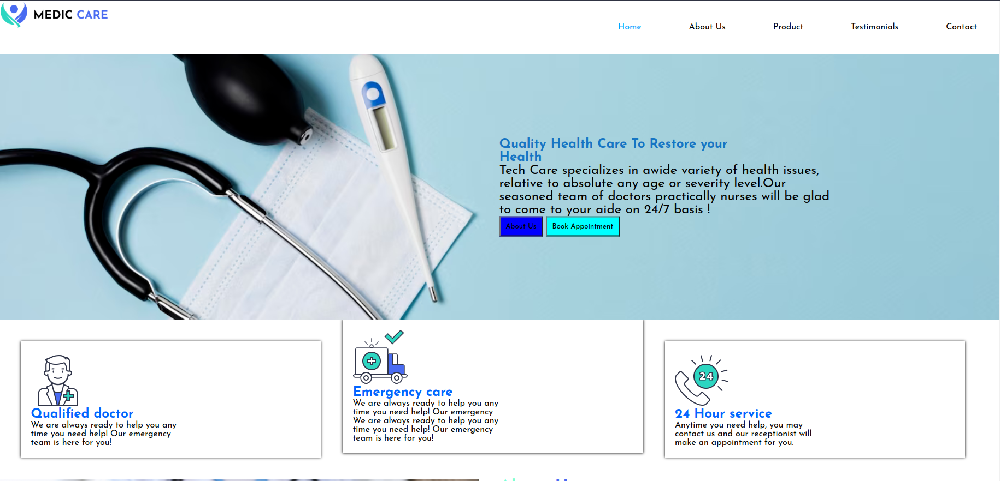
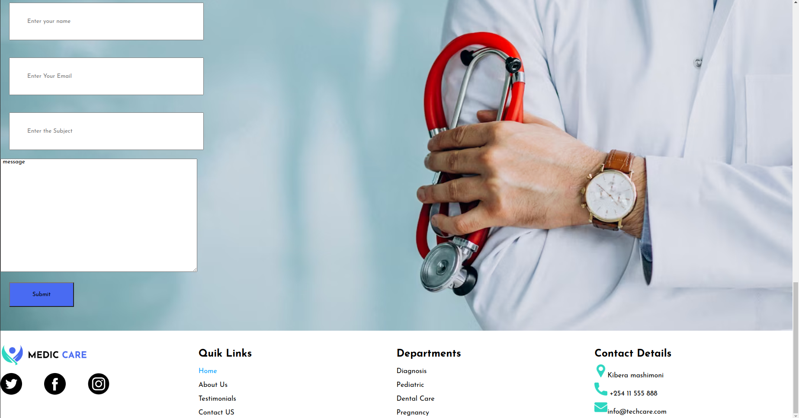

# Medicare-care-clinic
---
## Project Description
---
medicare is a website for an innovative medical company clients can visit and learn more about there treatment and services they offer.
## live-link
To acess the project live use this [link](https://mwangiyoung.github.io/medicare/)

## Screenshot
---
This how the projects look like.

- nav-section

- input-footer

## Technology used
* css
* index-html
  ## project set up and installation
  1. open the terminal and navigate where you want to store the project eg `cd Desktop`.
  2. to clone the github project paste this in the terminal `git clone https://github.com/mwangiyoung/medicare.git`.
  3. use `cd medicare` to enter to the project directory.
  4. open the project wih your favourite browser.
   
   ## contact
   if you would like to get in touch,for more infomation,collaboration, and feedback **(stevomwas@gmail.com)**
   ## license
   MIT License

Copyright (c) [2024] [***stephen mwangi***]

Permission is hereby granted, free of charge, to any person obtaining a copy
of this software and associated documentation files (the "Software"), to deal
in the Software without restriction, including without limitation the rights
to use, copy, modify, merge, publish, distribute, sublicense, and/or sell
copies of the Software, and to permit persons to whom the Software is
furnished to do so, subject to the following conditions:

The above copyright notice and this permission notice shall be included in all
copies or substantial portions of the Software.

THE SOFTWARE IS PROVIDED "AS IS", WITHOUT WARRANTY OF ANY KIND, EXPRESS OR
IMPLIED, INCLUDING BUT NOT LIMITED TO THE WARRANTIES OF MERCHANTABILITY,
FITNESS FOR A PARTICULAR PURPOSE AND NONINFRINGEMENT. IN NO EVENT SHALL THE
AUTHORS OR COPYRIGHT HOLDERS BE LIABLE FOR ANY CLAIM, DAMAGES OR OTHER
LIABILITY, WHETHER IN AN ACTION OF CONTRACT, TORT OR OTHERWISE, ARISING FROM,
OUT OF OR IN CONNECTION WITH THE SOFTWARE OR THE USE OR OTHER DEALINGS IN THE
SOFTWARE.
